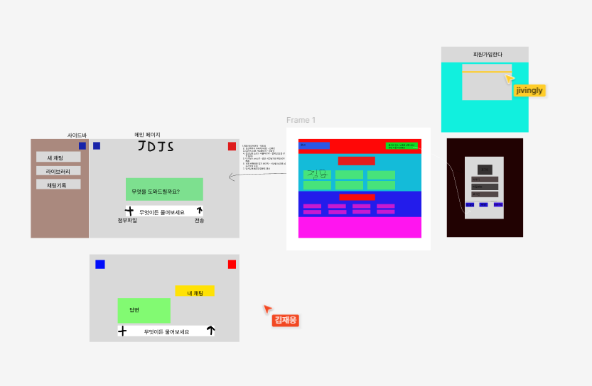

# 1차 프로젝트 2팀 회의록
 - 날짜: 2025년12월 15일
 - 팀명 :  JDJS = jipdanjisung(집단지성)
 - 참여자: 박민성(팀장),김재웅,정창규
## 오전 회의 내용
- 금요일 창규시 결석으로 인한 깃헙 초대 및 피그마 초대 완료
- 피그마에서 기초 구상 및 각자 개인이 맞은 임무 분담재

## 작업 목표
- 메인 페이지 구조와 css작성
- 로그인 페이지 구조와 css작성
- 질문 페이지 구조와 css작성

## 메인 페이지의 와이어 프레임 작성

## 작업 회고
- 처음 만나는사람들과 팀프로젝트를 하는건 처음이라 아직 미숙함
- 아직 모든게 서툴러서 좀 버벅거리는 감이있음
-figma 작성 익숙해지기
## 내일 목표
- 오늘다 하지못한 html css 작성하기
- html css 작성후 작동하는지 재검사
- 시간이 된다면 회원가입 페이지 와 마이페이지 작성

    
